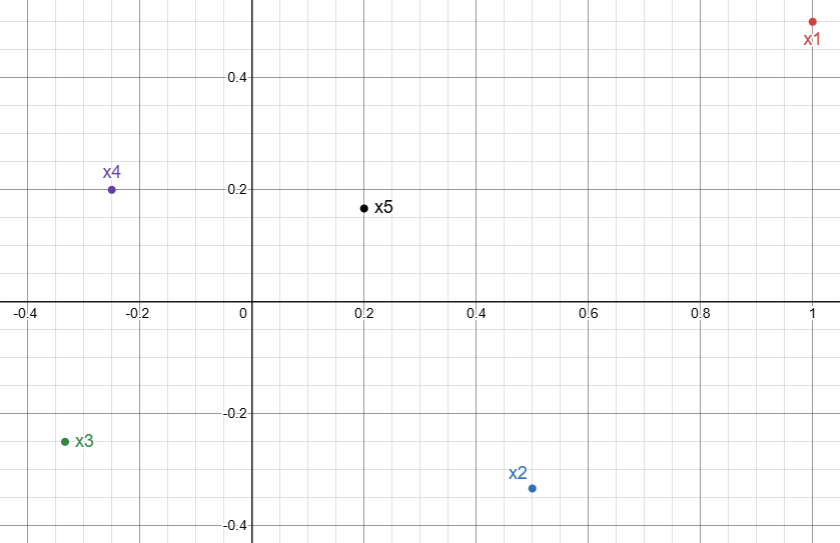

## Sequences of Real Numbers

- A sequence of real numbers is an assignment of a real number to each natural number
- A sequence is written as $$x_{1}, x_{2}, ..., x_{n}$$ where $x_{1}$ is the real number assigned to the natural number 1, the first number in the sequence, $x_{2}$ is the real number assigned to the natural number 2, the second number in the sequence, and so on...

## Examples

- Some example of a sequence of real numbers: $$\text{Sequence 1}: {2,4,6,8,...}$$ $$\text{Sequence 2}: {1, \frac{1}{2}, \frac{1}{3}, \frac{1}{4},...}$$ $$\text{Sequence 3}: {1,-1,1,-1,...}$$
- For each natural number $n$, each sequence has a well defined $n^{\text{th}}$ number $x_{n}$

## Limit of a Sequence

- There are basically three kinds of sequences
  1.  Sequences like sequence 1 in which the entries increase without bound
  2.  Sequences like sequence 2 in which the entries get closer and closer and stay close to the some limiting value
  3.  Sequences like sequence 3, in which neither behavior occurs, so that the entries jump back and forth on the number line

## Limit of a Sequence

- We are interested in the second type of sequence -- the one in which the entries approach arbitrarily close and stay arbitrarily close to some real number, called the limit of the sequence
- The $\epsilon$ interval about the number $r$ is defined to be the interval: $$ I_{\epsilon}(r) \equiv \{s \in \mathbb{R}: |s-r|<\epsilon\}$$
- In the interval notation: $$I_{\epsilon}(r) = (r-\epsilon,r+\epsilon)$$

## Limit of a Sequence

Definition: Let $x_{1}, x_{2}, ..., x_{n}$ be a sequence of real numbers and let $r$ be a real number. We say that $r$ is the **limit** of this sequence if for any small positive number $\epsilon$ there is a positive integer $N$ such that for all $n\geq N$, $x_{n}$ is in the $\epsilon-$interval about $r$; i.e., $$|x_{n}-r|<\epsilon$$ In this case, we say that the sequence converges to $r$ and we write: $$\lim x_{n} = r \text{ or } \lim_{n \rightarrow \infty}x_{n} = r \text{ or simply } x_{n} \rightarrow r$$

## Exercise

Find the limits of the sequences described below.

1.  {1,0,1/2,0,1/3,0}

2.  {1,-1/2,1/3,-1/4}

## Limit of a Sequence

- Theorem 1: A sequence can have at most one limit.
- Theorem 2: Let $x_{n}$ and $y_{n}$ be sequences with limits $x$ and $y$ respectively. Then the sequence $x_{n}+y_{n}$ converges to the limit $x+y$.
- Theorem 3: Let $x_{n}$ and $y_{n}$ be sequences with limits $x$ and $y$ respectively. Then the sequence of products $x_{n}y_{n}$ converges to the limit $xy$.

## Sequences in $\mathbb{R^{m}}$

- A sequence in $\mathbb{R^{m}}$ is an assignment of a vector in $\mathbb{R^{m}}$ to each natural number $n:\{ x_{1}, x_{2}, ... \}$
- Recall the distance between two points in $\mathbb{R^{m}}$ is $$\small d(x,y) = ||x-y|| = \sqrt{(x_{1}-y_{1})^{2}+(x_{2}-y_{2})^{2}+ ... +(x_{m}-y_{m})^{2}}$$
- This is called the Euclidean distance between two points
- The generalization of the $\epsilon$-interval $I_{\epsilon}(r)$ about a point $r$ on $\mathbb{R^{1}}$ is the $\epsilon$-ball in $\mathbb{R^{m}}$

## The $\epsilon$-ball in $\mathbb{R}^{m}$

- Definition: Let $r$ be a vector in $\mathbb{R}^{m}$ and let $\epsilon$ be a positive number. The $\epsilon$ ball about $r$ is: $$ B_{\epsilon}(r) \equiv \{x \in \mathbb{R}^{m}: ||x-r||<\epsilon\}$$
- Intuitively, a vector $x$ in $\mathbb{R}^{m}$ is close to $r$ if $x$ is in some $B_{\epsilon}(r)$ for a small but positive $\epsilon$
- The smaller $\epsilon$ is, the closure $x$ is to $r$

## Convergence in $\mathbb{R}^{m}$

Definition: A sequence of vectors $\{x_{1}, x_{2}, x_{3}, ...\}$ is said to converge to the vector $x$ if for any choice of a positive real number $\epsilon$ there is an integer $N$ such that, for all $n \geq N$, $x_{n} \in B_{\epsilon}(r)$; that is: $$d(x_{n},x) = ||x_{n}-x|| < \epsilon$$ - The vector $x$ is called the limit of the sequence

## Exercise

- Find whether the following sequence in $\mathbb{R}^{2}$ converges $$\small \left\{ \left( 1, \frac{1}{2}\right), \left( \frac{1}{2}, \frac{-1}{3}\right), \left( \frac{-1}{3}, \frac{-1}{4}\right), \left( \frac{-1}{4}, \frac{1}{5}\right), \left( \frac{1}{5}, \frac{1}{6}\right),...\right\}$$

## Exercise

{fig-align="center"}

## Convergence in $\mathbb{R}^{m}$
- Theorem: A sequence of vectors in $\mathbb{R}^{m}$ converges if and only if all $m$ sequences of its components converge in $\mathbb{R}^{1}$.
- Theorem: Let $\{x_{n}\}$ and $\{y_{n}\}$ be convergent sequences of vectors in $\mathbb{R}^{m}$ with limits $x$ and $y$ respectively. And let $\{c_{n}\}$ be a convergent sequence of real numbers with limit $c$. Then the sequence $\{c_{n}x_{n}+y_{n}\}$ converges to limit $cx+y$.

## Exercise
- If the $n^{th}$ term of a sequence is given by: 
$$x_{n} = \frac{8n}{3n-5}$$
Find whether this sequence converges or not. If yes, then find its limit.

## Exercise
- If the $n^{th}$ term of a sequence is given by: 
$$x_{n} = \frac{n}{n+2}$$
Find whether this sequence converges or not. If yes, then find its limit.